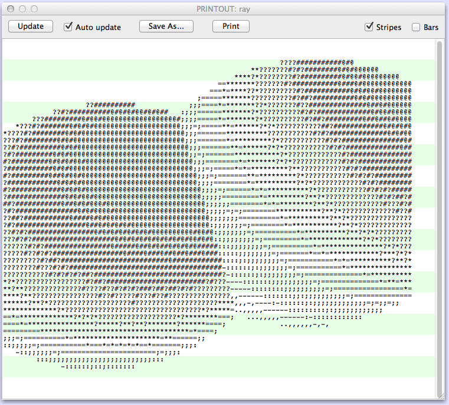

These are programs for the [IBM 1401](https://en.wikipedia.org/wiki/IBM_1401) computer.

The main program is `ray.aut`, a simple ray tracer that renders to the printer
using character art. If the B switch is off, a hard-coded scene is rendered.
If the B switch is on, the scene is loaded from a card deck that follows the
program in the card reader. See the source code (at `READSC`) for the format,
or use the `scene.card` file.

The `circle.aut` program draws a circle on the printer. It was written to test the
loop and printing logic.

The `ray.c` program is a fixed-point ray tracer in C. It was the prototype code
for the 1401 version. It prints the scene on the console. To run it, type
`make`.

To run the `.aut` files, install ROPE (see below) or run them on the IBM 1401
at the [Computer History Museum](http://www.computerhistory.org/atchm/restoring-the-ibm-1401/).

Resources
---------

- [ROPE 1401 assembler, emulator, and IDE](https://github.com/jpf/ROPE)
- [1401 Reference manual](http://bitsavers.trailing-edge.com/pdf/ibm/140x/A24-1403-5_1401_Reference_Apr62.pdf)
- [Autocoder specification](http://www.bitsavers.org/pdf/ibm/140x/J24-1434-2_autocoderSpec_61.pdf)
- [Coding techniques](http://bitsavers.trailing-edge.com/pdf/ibm/140x/TIE4-0064_1401codingTechniq.pdf)
- [IBM 1401 history, architecture, and details of the Computer History Museum one](http://ibm-1401.info/1401GuidePosterV9.html)

